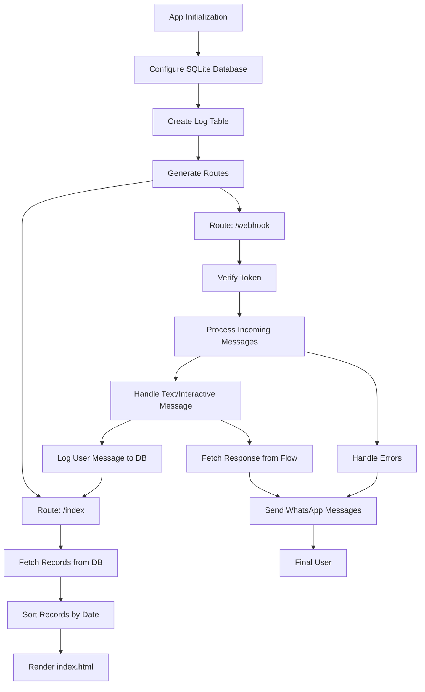

# Chatbot Demo

This repository contains a demo chatbot built in Python that leverages the Meta API to interact with a WhatsApp Business account. The project is structured to facilitate easy feature testing and deployment within a controlled environment, using Visual Studio Code as the development environment.

## Project Structure
```
CHATBOT-DEMO/
├── app/
│   ├── msgs/
│   │   ├── msg_receive.py
│   │   └── msg_send.py
│   ├── shared/
│   │   ├── config.txt
│   │   └── log.py
│   ├── trunk/
│   │   └── branches.py
│   ├── __init__.py
│   ├── business_logic.py
│   ├── data_access.py
│   └── views.py
├── static/
│   ├── images/
│   ├── scripts/
│   └── styles/
├── templates/
│   └── index.html
├── config.py
└── run.py
```

## Chatbot Logic 


## Folders and Files

- **`app/`**: Contains the core application logic.
  - **`msgs/`**: Handles sending and receiving messages via the Meta API.
  - **`shared/`**: Contains shared resources like configurations and logger info and debug.
  - **`trunk/`**: Implements flow handling logic.
  - **`__init__.py`**: Initializes the package.
  - **`business_logic.py`**: Contains the business logic for the chatbot.
  - **`data_access.py`**: Handles data access operations.
  - **`views.py`**: Manages the views and interfaces.
- **`static/`**: Static files for web-based interfaces.
  - **`images/`**: Directory for storing image files.
  - **`scripts/`**: Directory for storing JavaScript files.
  - **`styles/`**: Directory for storing CSS files.
- **`templates/`**: HTML templates for rendering views.
- **`config.py`**: Configuration settings for the application.
- **`run.py`**: Entry point to start the chatbot.

## Features

- **WhatsApp Business Integration**: Seamless integration with the WhatsApp Business API for message handling.
- **Logging**: Custom logging utility to monitor and track application behavior.
- **Modular Structure**: The project is organized into modular components for better maintainability and scalability.
- **Web Interface**: Simple HTML-based interface to interact with the chatbot.

## Getting Started

### Prerequisites

- Python 3.12
- Flask
- Other dependencies listed in requirements.txt

### Deployment

1. **Clone the repository:**
   ```bash
   git clone https://github.com/m1guel17/Chatbot-Demo.git
   ```
2. **Navigate to the project directory:**
   ```bash
   cd Chatbot-Demo
   ```
3. **Create and activate a virtual environment:**
    ```bash
    python3.12 -m venv venv
    source venv/Scripts/activate
    ```
4. **Install the required dependencies:**
    ```bash
    pip install -r requirements.txt
    ```
5. **Run the application:**
   ```bash
   python3.12 run.py
   ```

## Development

This project was developed using Visual Studio Code, which is recommended for its powerful features and ease of use. The `.vscode` settings are not included in the repository but can be easily configured according to your development preferences.

## Contributing

Contributions are welcome! Please fork this repository and submit a pull request with your enhancements or bug fixes.# Demo-Whatsapp-Chatbot
